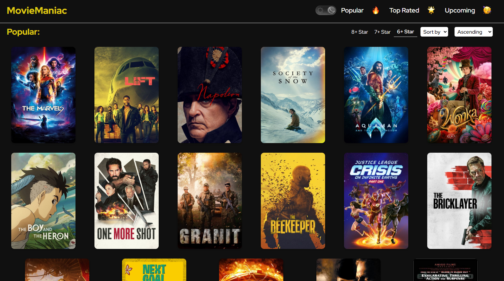
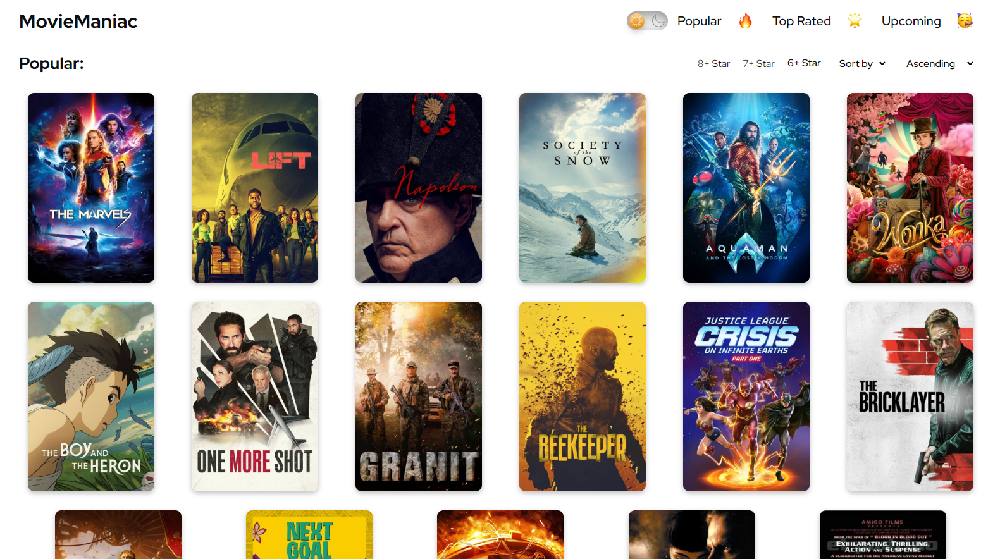

# 🎥 MovieManiac (React JS)

## Technologies used:

 

## Features:

### General purpose - filtering, sorting...

This project is basically an application for movie infos, filtering by rating and sorting by release date and ratings as well. The source for popular, top rated and upcoming movies is [TMDB API](https://developer.themoviedb.org/reference/intro/getting-started).

### Light theme:

For better UX, light theme (toggled by a switch at the top) has been implemented:

